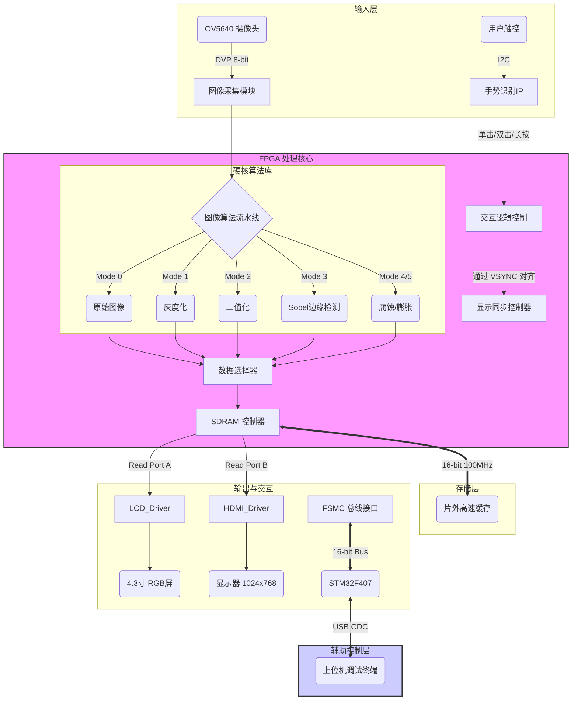

# 📸 基于 FPGA + STM32 的实时视频处理与双显示系统

 
 
 


> **🎓 课程设计作品**：打造一个高可用、交互性强、算法集成的嵌入式异构视觉系统。

---

## 📖 项目背景与概述 (Overview)

本项目不仅仅是一个简单的摄像头显示 Demo，而是一个完整的**嵌入式异构协同系统**。它创新性地结合了 **FPGA** 强大的并行计算能力与 **STM32** 灵活的控制能力：

*   🚀 **FPGA (xc7a50tfgg484-1)**：作为计算核心，负责 OV5640 视频流采集、由硬件流水线实现的**实时图像算法处理**、SDRAM 高速缓存调度以及 LCD/HDMI 双屏同步驱动。
*   🧠 **STM32 (F407ZGT6)**：作为控制/监控核心，通过 **FSMC 总线**与 FPGA 建立高速通信链路，负责系统状态监控、参数动态配置以及与 PC 上位机的 USB 交互。

---

## 🏗️ 系统架构 (System Architecture)

为了让老师和同学一眼看懂数据流向，特绘制如下系统数据流图：



---

## ✨ 核心功能与亮点 (Highlights)

### 1. 🎨 丰富的实时图像处理 (Real-time Processing)
不需要 CPU 参与，完全由 FPGA 硬件流水线实现，延迟极低（微秒级）。长按屏幕或通过上位机即可循环切换：
| 模式 ID | 算法名称 | 视觉效果 | 技术说明 |
| :---: | :--- | :--- | :--- |
| **0** | **Original** | 彩色原图 | RGB565 直通，色彩还原度高 |
| **1** | **Grayscale** | 灰度视图 | 加权平均法 `R*0.299 + G*0.587 + B*0.114` |
| **2** | **Binary** | 二值化 | 动态阈值比较，**支持 STM32 在线调节阈值** |
| **3** | **Sobel** | 边缘检测 | 经典 3x3 算子卷积，提取物体轮廓 |
| **4** | **Erode** | 形态学腐蚀 | 3x3 窗口最小值滤波，去除孤立噪点 |
| **5** | **Dilate** | 形态学膨胀 | 3x3 窗口最大值滤波，填充孔洞 |

### 2. 🖥️ 无缝双显切换 (Dual Display)
*   **LCD 模式**：适配 4.3寸/7寸 RGB 屏幕，支持触摸操作。
*   **HDMI 模式**：通过**双击屏幕**一键投屏到大显示器。
    *   ⚡ **包含 Scaling 逻辑**：自动调整时序适配 XGA (1024x768) 分辨率。
    *   ⚡ **专用时钟树**：独立生成的 65MHz 像素时钟和 325MHz 串行时钟，保证 HDMI 信号质量。

### 3. 👆 智能手势交互 (Smart Gesture)
告别枯燥的按键，全触摸操作体验：
*   👆 **单击**：**画面冻结/解冻**（类示波器 Stop/Run 功能，方便观察高速运动物体细节）。
*   ✌️ **双击**：**LCD / HDMI 输出切换**。
*   🖐️ **长按**：**循环切换图像处理算法**。

---

## 🔧 关键挑战与解决方案 (Challenges & Solutions)

> [!IMPORTANT]
> 本项目在开发过程中遇到了多个典型的 FPGA 系统设计难点，以下是我们的攻克方案，也是本设计的核心技术价值所在。

### 1. 动态画面撕裂 (Tearing Effect) 🛑
*   **问题现象**: 在摄像头快速移动时，屏幕中下部出现明显的水平断裂线，严重影响视觉体验。
*   **技术归因**: SDRAM 的读写通过 FIFO 进行缓冲，但读写速率不匹配（Camera 24MHz vs LCD 9MHz/HDMI 65MHz），导致读指针“追上”了写指针，读取到了上一帧的残余数据。
*   **💡 解决方案**:
    *   **Bank 乒乓机制**: 实现了严格的 Bank 切换逻辑，写入 Bank 0 时，读取 Bank 1，反之亦然。这在逻辑上隔离了读写操作。
    *   **VSYNC 强对齐**: 仅仅做双 Bank 是不够的。我们强制在摄像头场同步信号 (VSYNC) 的**上升沿**才允许切换 Bank 指针，确保每一帧数据的完整性。
    *   **代码位置**: `ov5640_rgb565_lcd.v` 中的 `sdram_wr_en_gated` 和同步状态机。

### 2. 多时钟域数据交互 (CDC Stability) 🔄
*   **问题现象**: 系统偶尔出现数据总线乱码、状态机卡死，Vivado 时序报告显示大量 Setup/Hold 违例。
*   **技术归因**: 系统存在 4 个完全异步的时钟域：Camera PCLK (~24MHz), System (100MHz), FSMC (150MHz), HDMI (65MHz)。
*   **💡 解决方案**:
    *   **异步 FIFO 隔离**: 所有跨域的大数据流（如视频像素流）均通过 Async FIFO 进行物理隔离。
    *   **双触发器打拍**: 控制信号（如模式切换 `mode_change`、复位信号）使用 `(* ASYNC_REG = "TRUE" *)` 标记的二级寄存器进行同步，消除亚稳态。
    *   **XDC 约束优化**: 在 `async_clocks.xdc` 中使用 `set_clock_groups -asynchronous` 明确告知综合器忽略无关的异步路径，专注于关键路径的时序收敛。

### 3. HDMI 与 LCD 分辨率自适应 (Resolution Adaptation) 📺
*   **问题现象**: 从 LCD (480x272) 切换到 HDMI (1024x768) 时，画面撕裂严重或无信号。
*   **💡 解决方案**:
    *   **动态重配**: 双击触发切换时，`picture_size.v` 模块会根据 `output_mode` 实时修改摄像头的 `H_TOTAL` 和 `V_TOTAL` 寄存器。
    *   **时钟门控复位**: 切换瞬间触发 `i2c_config_rst_n` 复位脉冲，强制 I2C 状态机复位并重新发送适配新分辨率的摄像头配置指令。

### 4. 触摸误触与手势识别 (Touch Debounce) 👆
*   **问题现象**: 手指轻微移动会被误判为多次点击，或者滑动操作被误判为点击。
*   **💡 解决方案**:
    *   **欧氏距离阈值**: 引入坐标偏差检测，只有按下点与抬起点的距离超过 **30 像素** 才视为滑动/操作，否则视为原地点击。
    *   **时间窗口状态机**: 设定 **100ms** 的双击判定窗口。单击后进入等待状态，若窗口内无第二次点击则确认为单击，否则确认为双击。

---

## 📂 核心目录索引 (Directory Structure)

```bash
FPGA_CourseDesign/
├── 📁 camera_prj/               # [核心] FPGA Vivado 工程
│   ├── 📄 top_camera.v          # 顶层例化与双向总线控制
│   ├── 📁 bsp/image/            # 图像算法库 (Sobel, Binary, Morphology...)
│   ├── 📁 bsp/hdmi/             # HDMI 编码与 SerDes 驱动
│   ├── 📁 bsp/touch/            # 触摸驱动与手势状态机 (debounced)
│   ├── 📁 bsp/sdram/            # SDRAM 控制器与 Ping-Pong FIFO
│   └── 📁 bsp/fsmc/             # 与 STM32 通信的 FSMC 接口模块
├── 📁 STM32F407_fsmc/           # [辅助] STM32 Keil/EIDE 工程
│   ├── 📄 main.c                # USB 命令解析与 FSMC 读写主循环
│   └── 📁 USB_DEVICE/           # USB CDC 虚拟串口驱动
├── 📁 xdc/                      # [配置] 引脚约束文件 (约束异步时钟组)
└── 📄 README.md                 # 本说明文档
```

---

## ⚡ 快速开始 (Quick Start)

### 硬件连接
1.  **摄像头**：将 OV5640 模组插入开发板摄像头接口。
2.  **显示**：连接 4.3寸/7寸 LCD 屏，或通过 HDMI 线连接显示器。
3.  **调试**：使用 USB 线连接 STM32 的 USB_SLAVE 接口到电脑（用于串口调试）。

### 运行步骤
1.  **FPGA 下载**：使用 Vivado 打开 `camera_prj`，生成 Bitstream 并下载。
    *   *现象：LCD 应显示摄像头采集画面。*
2.  **STM32 下载**：使用 Keil/EIDE 打开 `STM32F407_fsmc`，编译并下载。
    *   *现象：LED 开始闪烁，表示系统心跳正常。*
3.  **交互体验**：
    *   尝试双击屏幕，观察 HDMI 输出。
    *   长按屏幕，观察 Sobel 边缘检测等效果。
4.  **高级调试 (可选)**：
    *   打开串口助手 (波特率任意)，发送字符 `H`。
    *   你将看到系统返回的详细诊断报告（如下所示）。

```text
> H
--- FPGA Internal Status ---
[0x00] TOUCH_VALID : 1
[0x04] CAM_H_PIXEL : 800
[0x05] CAM_V_PIXEL : 480
[0x08] FRAME_COUNT : 1245  <-- 正在跳动
[0x0D] ALGO_MODE   : 3     (Sobel)
...
```

---

## 🙋 致谢与参考 (Acknowledgements)
*   感谢 **正点原子** 提供的基础驱动例程。
*   项目参考了 **OpenEdv** 社区的开源资料。
*   特别感谢指导老师的悉心教导。

---
*Created by [Your Name/Student ID] for FPGA Course Design, 2026.*
